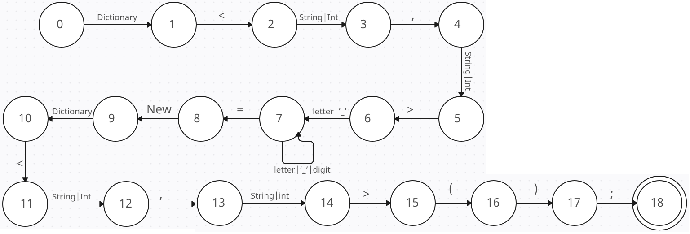
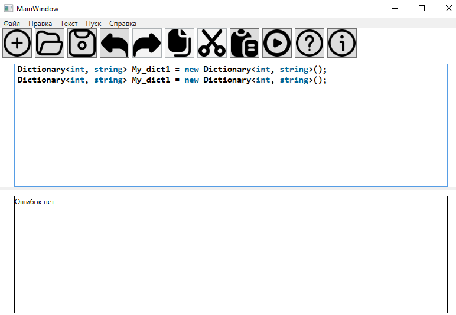
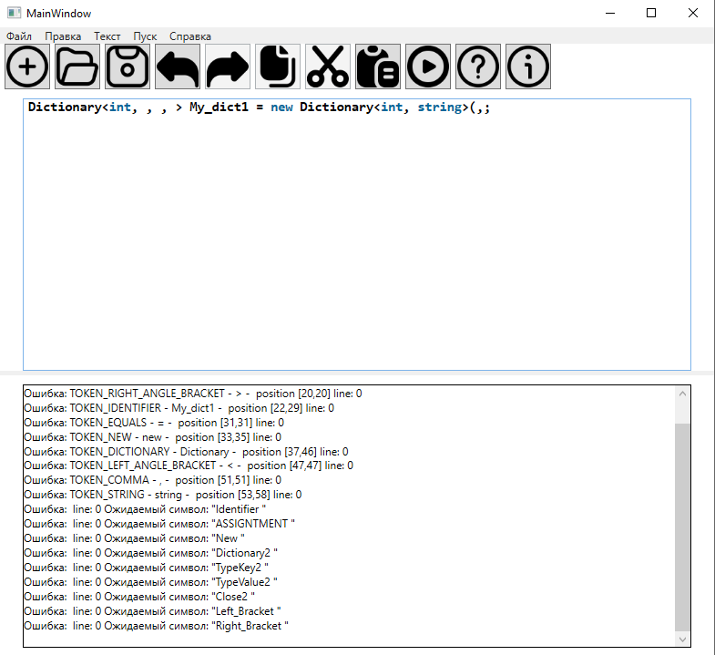
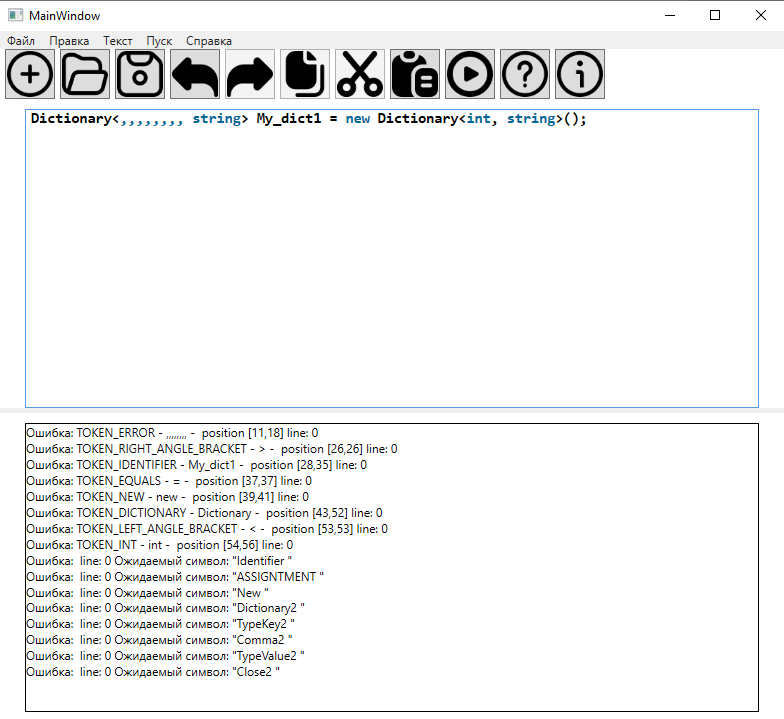

# Объявление ассоциативного массива языка C# 18 вариант


## Примеры допустимых строк
```
Dictionary<int, string> My_dict1 = new Dictionary<int, string>();
Dictionary<int, string> _Dict = new Dictionary<int, string>();
```
## Разработанная грамматика
```
1. <DEF> -> ‘Dictionary’ <DICTIONARY>
2. <DICTIONARY> -> ‘<’ <TYPEKEY>
3. <TYPEKEY> -> (int|string) <COMMA>
4. <COMMA> -> ‘,’ <TYPEVALUE>
5. <TYPEVALUE> -> (int|string) <CLOSE>
6. <CLOSE> -> ‘>‘ <ID>
7. <ID> -> (letter|’_’) <IDREM>
8. <IDREM> -> (letter|’_’|digit) <IDREM>
9. <IDREM> -> = <ASSIGNTMENT>
10. <ASSIGNTMENT> -> new <NEW>
11. <NEW> -> Dictionary <DICTIONARY2>
12. <DICTIONARY2> -> ‘<’ <TYPEKEY2>
13. <TYPEKEY2> -> (int|string) <COMMA2>
14. <COMMA> -> ‘,’ <TYPEVALUE2>
15. <TYPEVALUE2> -> (int|string) <CLOSE2>
16. <CLOSE2> -> ‘>’ <RBRACKET>
17. <RBRACKET> -> ‘(’ <LBRACKET>
18. <LBRACKET> -> ‘)’ <END>
19. <END> ; ->

```
## Граф конечного автомата


## Тестовые примеры


